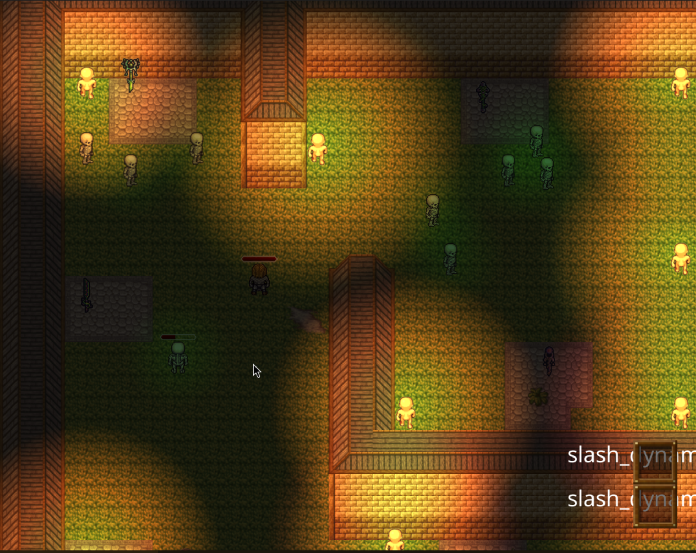

# Engine Demo

## Basic Overview

This is a demo of the engine in action. It is a simple game where the player can move around and interact with the world. The player can pick up items, use items, and interact with enemies in the world.

Features of the engine that are showcased in this demo include:

- Dynamic lighting
- Sounds
- Entity customization
- Entity interaction and pathfinding
- Inventory system
- UI menu system and toolbox
- Networked multiplayer (undocumented and unstable edge cases)
  - see `Dynamics/Options/network.json` and `SERVER_ADDRESS` option to connect to other system for multiplayer

## Controls

Controls are mapped for both keyboard and future gamepad input. All menus can be navigated with the mouse as well as the keyboard.

All current actions that can be done via left and right click will be shown in the bottom left of the screen. Top action is left click, bottom action is right click.

The following controls are the base controls for the demo:

- **Move Up**: `W` or `UP`
- **Move Down**: `S` or `DOWN`
- **Move Left**: `A` or `LEFT`
- **Move Right**: `D` or `RIGHT`
- **Action A**: `1` or `Left Mouse Button`
- **Action B**: `2` or `Right Mouse Button`
- **Toggle Inventory**: `3` or `E`
- **Cycle Actions A,B**: `4` or `Q`

The following are controls to access debug features of the engine:

- **C**: Open character customizer for player

  - This key opens the character customization menu for the player

- **K**: Open debug menu

  - This key opens the debug menu where more changes can be made, incuding adding other entities to the world or showing performance graphs

- **F**: Toggle Framestep Mode
  - This mode allows the user to step through the game frame by frame. All other inputs must be held down while in this mode to apply them when pressing **space** to advance a frame

Via the debug features there are _many many_ ways to crash the engine, and not all functionality works completely.
